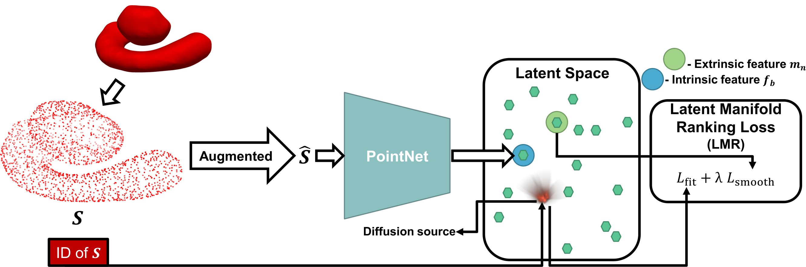
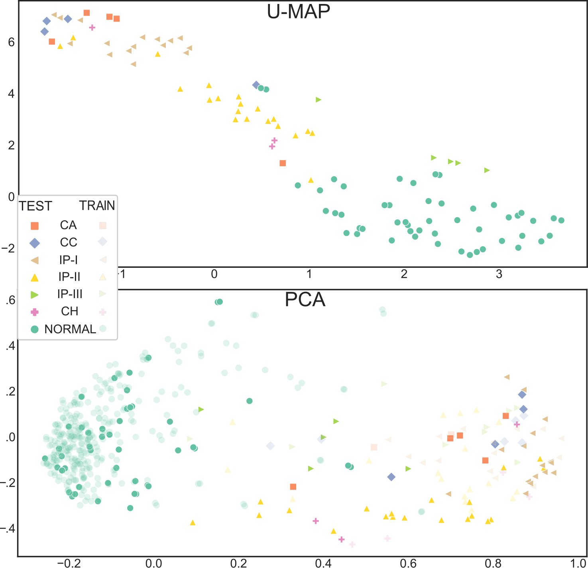

# Unsupervised 3D mesh  classification in pytorch using DeepDiffusion and 3D pointclouds

This repository contains the code for the paper
 [_Unsupervised classification of congenital inner ear
malformations using DeepDiffusion for latent
space representation_](https://doi.org/10.1007/978-3-031-43904-9_63) presented at the 26th International Conference on Medical Image Computing and Computer Assisted Intervention (MICCAI 2023).



## Code

### Data

To generate the corresponding pointclouds for each 3D mesh of your dataset and store them in the corresponding dataset in h5 format you must run generate_h5_dataset.py.

### Training 

The file used to train and evaluate the training is shape_classification_DD.py. 


### Output

The saved model and the embeddings of the test set are stored in the output folder which can be used to display different visualizations of the latent space as we showed in our paper as:




## Getting started
### Setup 

We recomend setting up a virtual enviroment for running the code. 

The enviroment for running this code can be created by using the following commands:

   ```shell
   conda create -n DD_shape python=3.8
   conda activate DD_shape
   pip install  pandas pytorch-lightning  pyvista scipy h5py sobol sobol_seq meshio tensorboard pytorch_geometric
   ```

### Toy dataset and first training

The dataset used for the publication which consists in various 3D meshes of normal and malformed cochleas cannot be made public. 

If you want to run this code and play with the dataset used in [_DeepDiffusion: Unsupervised Learning of Retrieval-Adapted Representations via Diffusion-Based Ranking on Latent Feature Manifold_](https://ieeexplore.ieee.org/document/9934898). The dataset can be downloaded [_here_](http://3dvision.princeton.edu/projects/2014/3DShapeNets/ModelNet10.zip):

You should move all the meshes to a data folder and you can generate the dataset using the following commands from the data folder:

   ```shell
   python generate_h5_dataset.py --in_dirname ./ModelNet10/data --n_point 1024 --labels ./labels_train.txt --classes ./classes.txt --out_filepath ./training_set.h5
   python generate_h5_dataset.py --in_dirname ./ModelNet10/data --n_point 1024 --labels ./labels_test.txt --classes ./classes.txt --out_filepath ./testing_set.h5
   ```

You can then train a model using the following command from the root directory:

   ```shell
   python  shape_classification_DD.py

   ```

